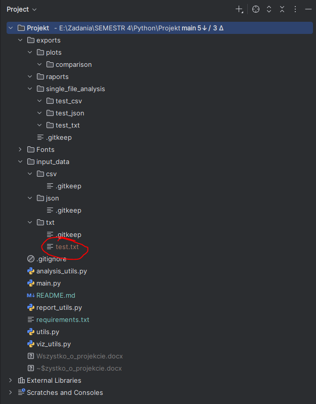

# System Analizy Tekstu i Statystyk Słów

Autorzy:
- Damian Zwolak 
- Krystian Zygmunt 
- Jakub Strzępek

## Spis treści
1. [Opis projektu](#opis-projektu)
    - [Cel projektu i czego dotyczy](#cel-projektu-i-czego-dotyczy)
    - [Technologie i narzędzia](#technologie-i-narzędzia)
    - [Podział obowiązków](#podział-obowiązków)
    - [Instrukcje instalacji](#instrukcje-instalacji)
2. [Struktura projektu](#struktura-projektu)
    - [Opis folderów i plików](#opis-folderów-i-plików)
        - [Struktura folderów](#struktura-folderów)
        - [Struktura plików](#struktura-plików)
3. [Dokładna analiza plików](#dokładna-analiza-plików)
4. [Przykłady działania](#przykłady-działania)
    - [Przykładowa analiza jednego pliku](#przykładowa-analiza-jednego-pliku)
        - [Teoria](#teoria)
        - [Praktyka](#praktyka)
    - [Przykładowa analiza wielu plików](#przykładowa-analiza-wielu-plików)
        - [Teoria](#teoria-1)
        - [Praktyka](#praktyka-1)
5. [Podsumowanie](#podsumowanie)
6. [Bibliografia](#bibliografia)

## 1. Opis projektu
### Cel projektu i czego dotyczy
Celem projektu jest stworzenie narzędzia do analizy tekstu i statystyk słów. Narzędzie to ma na celu ułatwienie analizy tekstów, takich jak artykuły, książki czy inne dokumenty, poprzez dostarczenie różnych statystyk i wizualizacji.

### Technologie i wymagane narzędzia
- Języki: Python 3.9+
- Biblioteki:
  - re, collections (analiza tekstu)
  - csv, json, unicodedata (przetwarzanie danych)
  - python-docx (DOCX), fpdf (PDF), openpyxl (XLSX)
  - pandas (XLSX, tabele)
  - matplotlib (wizualizacje)
- Wszystkie wymagane biblioteki znajdują się w pliku requirements.txt
- Środowisko: dowolne z interpreteren Python, Linux/Windows/macOS

### Podział obowiązków
- Damian Zwolak – główny skrypt (main.py), dokumentacja (README.md)
- Krystian Zygmunt – raporty (report_utils.py), analizy (analysis_utils.py)
- Jakub Strzępek – wizualizacje (viz_utils.py), przetwarzanie danych (utils.py)

### Instrukcje instalacji
1. Upewnij się, że masz zainstalowanego Pythona 3.9 lub nowszego.
2. Pobierz repozytorium na swój komputer. Wpisz w terminalu:
   ```bash
   git clone https://github.com/dazw00110/system-analizy-tekstu-statystyki-slow
   ```
3. Przejdź do katalogu projektu:
   ```bash
    cd system-analizy-tekstu-statystyki-slow
    ```
4. Zainstaluj wymagane biblioteki:
5. ```bash
   pip install -r requirements.txt
   ```
6. Przygotuj dane tekstowe do analizy i wrzuć je do folderu input_data txt, csv, json w zależności od formatu
7. Uruchom skrypt główny:
   ```bash
   python main.py
   ```
8. W folderze exports pojawią się dane po analizie oraz raporty w formacie PDF, XLSX i DOCX. 

## 2. Struktura projektu

### Opis folderów i plików
#### Struktura folderów:
- `input_data/` - folder z danymi wejściowymi do analizy, tutaj wrzucamy pliki do analizy
    - `txt/` - folder z plikami tekstowymi
    - `csv/` - folder z plikami CSV
    - `json/` - folder z plikami JSON
- `exports/` - folder z danymi wyjściowymi po analizie
  - `raports/` - folder z raportami w roznych formatach
    - `csv/` - folder z raportami w formacie CSV
    - `pdf/` - folder z raportami w formacie PDF
    - `xlsx/` - folder z raportami w formacie XLSX
    - `docx/` - folder z raportami w formacie DOCX
  - `plots/comparison` - folder z wykresami porównującymi zawartość plików
  - `single_file_analysis` - folder z wykresami analizy pojedynczego pliku, tworzy folder o nazwie nazwa oryginalnego pliku _ rozszerzenie pliku np z test.txt tworzy folder test_txt, a w nim zapisuje analizę
- `Fonts` - folder z czcionkami do wykresów - aby była obsługa polskich znaków- 
- `documentation_data/` - folder ze zdjeciami do dokumentacji

#### Struktura plików:
- `main.py` - główny skrypt uruchamiający program
- `utils.py` - funkcje pomocnicze do przetwarzania danych
- `analysis_utils.py` - funkcje do analizy tekstu
- `report_utils.py` - funkcje do generowania raportów
- `viz_utils.py` - funkcje do generowania wykresów
- `requirements.txt` - plik z wymaganymi bibliotekami
- `README.md` - plik z opisem projektu
- `.gitignore` - plik z ignorowanymi plikami przez git

## 3. Dokładna analiza plików 
    1. main.py - główny skrypt uruchamiający program:
        - importuje wszystkie potrzebne biblioteki
        - uruchamia funkcje do analizy tekstu
        - uruchamia funkcje do generowania raportów
        - uruchamia funkcje do generowania wykresów
    2. utils.py - funkcje pomocnicze do przetwarzania danych:
        - read_csv - funkcja do odczytu pliku CSV
        - read_json - funkcja do odczytu pliku JSON
        - read_txt - funkcja do odczytu pliku TXT
        - count_words - funkcja do zliczania słów w pliku
    3. analysis_utils.py - funkcje do analizy tekstu:
        - funkcja analyze_text - funkcja do analizy tekstu, czyli funkcja do zliczania słów, zdań, akapitów, znaków, długości słów i zdań
    4. report_utils.py - funkcje do generowania raportów:
        - strip_accents - funkcja do usuwania akcentów z tekstu
        - save_report_csv - funkcja do zapisywania raportu w formacie CSV
        - save_report_pdf - funkcja do zapisywania raportu w formacie PDF
        - save_report_xlsx - funkcja do zapisywania raportu w formacie XLSX
        - save_report_docx - funkcja do zapisywania raportu w formacie DOCX
    5. viz_utils.py - funkcje do generowania wykresów:
        - create_summary_table - funkcja do tworzenia tabeli podsumowującej
        - plot_comparison_metrics - funkcja do tworzenia wykresów porównawczych
        - plot_single_file_analysis - funkcja do tworzenia wykresów analizy pojedynczego pliku


## 4. Przykłady działania

### Przykładowa analiza jednego pliku
Analizę przeprowadzimy na pliku w formacie txt, ponieważ ten format jest bardzo często wykorzystywany w analizach tekstowych. W przypadku innych formatów, takich jak CSV czy JSON, proces jest bardzo podobny. Należy tylko wrzucić pliki do folderów json lub csv i uruchomić skrypt `main.py`. W folderze `exports/` pojawią się raporty w formacie PDF, XLSX i DOCX.

#### TEORIA
1. Przygotuj plik tekstowy w folderze `input_data/txt/`
2. Uruchom skrypt `main.py`:
```bash
python main.py
```
3. Sprawdź folder `exports/` - powinny pojawić się pliki z analizą i raportami
    - `exports/plots/comparison` - w tym folderze pojawia się wykres porównawcze, jeśli działamy na wielu plikach
    - `exports/raports/txt/` - powinny pojawić się raporty w formacie TXT
    - 'single_file_analysis/test_txt' - powinny pojawić się wykresy analizy pojedynczego pliku TXT

#### PRAKTYKA:
1. Przygotowaliśmy przykładowy plik tekstowy `input_data/txt/test.txt` z danymi do analizy


Tak wygląda zawartość pliku test.txt


2. Uruchamiamy skrypt `main.py`:
```bash
python main.py
```


3. Sprawdzamy folder `exports/` - powinny pojawić się pliki z analizą i raportami
    - `exports/plots/comparison` - w tym folderze pojawia się wykres porównawcze, jeśli działamy na wielu plikach
    - `exports/raports/txt/` - powinny pojawić się raporty w formacie TXT
    - `single_file_analysis/test_txt` - powinny pojawić się wykresy analizy pojedynczego pliku TXT

Jak widać dane zostały przeanlizowane i zapisane w odpowiednich folderach 


Tak wyglądają raporty w formacie PDF, XLSX i DOCX
- DOCX 


- CSV 


- XLSX 


- PDF  


### Przykładowa analiza wielu plików

#### TEORIA
Analiza przebiega tak samo jak dla jednego pliku, musimy tylko dodać drugi plik do folderu z danymi. W przypadku plots/comparison pojawi się wykres porównawczy dla dwóch plików. W przypadku raportów w formacie PDF, XLSX i DOCX pojawią się dwa raporty, jeden dla każdego pliku. W przypadku raportów w formacie CSV pojawi się jeden raport z danymi z obu plików.

#### PRAKTYKA
1. Przygotowaliśmy przykładowe pliki tekstowe `input_data/txt/test.txt` i `input_data/txt/test2.txt` z danymi do analizy


2. Uruchamiamy skrypt `main.py`:
```bash
python main.py
```


3. Sprawdzamy pliki po analizie najbardziej bedzie interesował nas folder plots/comparison, ponieważ tam będą wykresy porównawcze. Otrzymane wykresy:


Jak widać szczegółowa analiza została przeprowadzona i zapisana w odpowiednich folderach

## 5. Podsumowanie
Projekt został zrealizowany zgodnie z założeniami. Narzędzie do analizy tekstu i statystyk słów działa poprawnie i dostarcza różnych statystyk i wizualizacji. Narzędzie to może być używane do analizy różnych tekstów, takich jak artykuły, książki czy inne dokumenty. 
Dzięki zastosowaniu różnych formatów raportów, użytkownik ma możliwość wyboru formatu, który najlepiej odpowiada jego potrzebom. Narzędzie to może być używane w różnych dziedzinach, takich jak nauka, biznes czy edukacja. Dzięki temu narzędziu użytkownik ma możliwość szybkiej analizy tekstu i uzyskania różnych statystyk i wizualizacji. Narzędzie to jest łatwe w użyciu i nie wymaga specjalistycznej wiedzy z zakresu analizy tekstu.


## 6. Bibliografia
- Python Documentation: https://docs.python.org/3/
- Pandas (XLSX): https://pandas.pydata.org/docs/
- Matplotlib (Wykresy): https://matplotlib.org/stable/contents.html
- python-docx (DOCX): https://python-docx.readthedocs.io/
- FPDF (PDF): https://pyfpdf.readthedocs.io/
